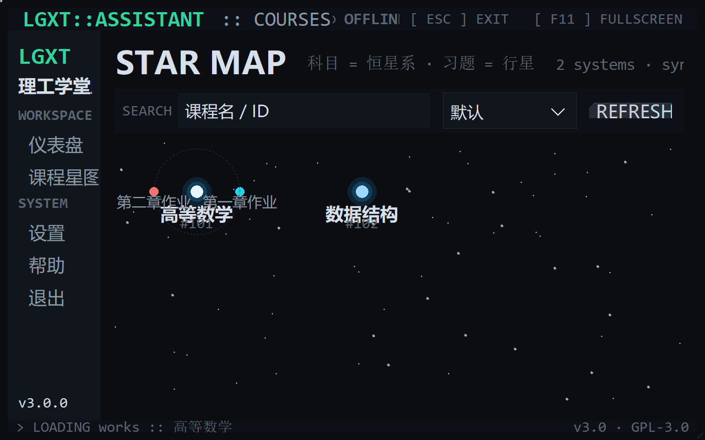
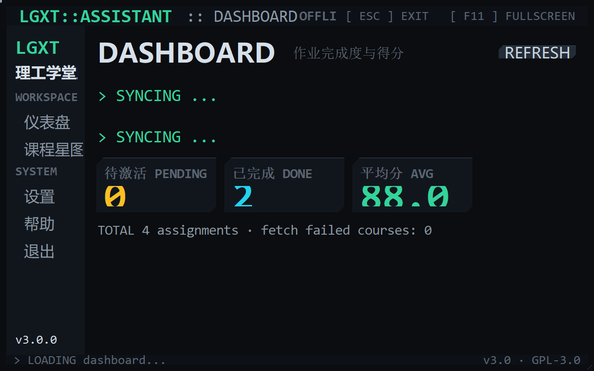

# LGXT Assistant · 理工学堂助手

> 一个面向理工学堂平台的 Windows 桌面工具：课程星图浏览、作业与题目查看、
> Word/PDF 导出（含答案与题目图片）、单个/批量成绩提交。
>
> 界面为 **宇宙星链 / Developer Workbench** 风格：无边框工作台、代码绘制的星点背景、
> 悬停光轨、科目恒星系与行星习题、金属切角面板、深色透光按钮（悬停光效 + 轻音效）、
> 仪表盘统计，以及退出时的代码雨特效。





---

## 一、快速开始

### 1. 直接运行（推荐）
从 Releases 下载 `LGXT-Assistant.exe`，双击运行，无需安装 Python。

### 2. 从源码运行
```bash
pip install -r requirements.txt
python default.pyw
```
环境：Windows + Python 3.7 及以上。

## 二、界面与交互

| 特性 | 说明 |
|---|---|
| 无边框工作台 | 隐藏系统原生标题栏与最小化/关闭按钮；标题栏可拖动，右下角三角可缩放 |
| 退出方式 | **ESC** 退出（先播放约 1.8s 代码雨）；也可点侧栏「退出」 |
| 全屏 | **F11** 在「全屏 / 工作区」间切换；双击标题栏最大化工作区 |
| 星点背景 | 全部由 Canvas 代码绘制：星点持续漂浮闪烁 |
| 悬停光轨 | 鼠标靠近星点时，附近星点产生向光标汇聚的青色光轨 |
| 金属切角 | 面板/按钮使用硬朗切角多边形 + 双色金属描边（无圆角、无系统边框） |
| 透光按钮 | 深色透光切角按钮；悬停出现光效并播放轻音效（设置页可关闭） |

## 三、功能教程

### 1. 登录
AUTH 面板输入用户名/密码；勾选「记住密码」写入 Windows 凭据库（keyring）。
登录成功后右上角显示 `● CONNECTED`。

### 2. 仪表盘
侧栏 → **仪表盘**：
- **待激活 PENDING**：尚未提交且仍有剩余次数的作业数量；
- **已完成 DONE**：已有成绩的作业数量；
- **平均分 AVG**：已完成作业成绩的算术平均；
- 下方显示作业总数与读取失败的课程；`REFRESH` 重新统计。

> 所有数字均来自服务器真实返回，不做任何推测或伪造。

### 3. 课程星图（科目 = 恒星系，习题 = 行星）
侧栏 → **课程星图**：
- 每颗恒星代表一门课程；**单击恒星**展开/收起其习题行星（展开时才请求该课程作业）；
- 行星颜色：🟢 可提交 / 🟠 仅剩最后一次 / 🔴 已用完 / 🔵 已完成；
- **单击行星**直接进入题目工作区；展开失败时恒星下方显示 `LOAD FAILED`，再次单击可重试；
- 顶部：`SEARCH` 按课程名/ID 过滤，`SORT` 名称或 ID 排序，`REFRESH` 重新同步；
- 右侧：`EXPORT ALL` 导出全部课程、`SUBMIT ALL 100` 批量提交全部课程。

### 4. 作业工作区（List + Inspector）
- 左列表：`SEARCH`（作业名/章节/ID）、`FILTER`（全部/可提交/已用完）、`SORT`（截止时间/剩余/名称）；
- 右侧 **INSPECTOR**：ID、章节、截止时间、成绩、尝试次数、状态（DONE/EXHAUSTED）；
- `OPEN ▸ 题目` 进入题目页（或双击列表行）；`EXPORT 题目` 单独导出该作业；
- 顶部 `EXPORT ALL` / `SUBMIT ALL 100` / `REFRESH` 作用于当前课程。

### 5. 题目工作区（三栏）
- 左：题目列表（`SEARCH` 题名/答案/ID、`FILTER` 全部/有答案/无图片、`SORT` 编号/名称）；
- 中：题面名称、ID 与图片（后台下载，内存 + 文件双层缓存）；
- 右：**INSPECTOR** 显示答案，输入 0–100 后 `SUBMIT` 提交该作业成绩；
- `‹` / `›` 切换题目，页头 `‹ 返回作业列表` 返回。

### 6. 导出
- 目录结构：`<导出路径>/作业/<课程名>(ID_x)/<作业名>(ID_y)/`
  - `题目图片/<题目ID>.png`
  - `<作业名>.docx`、`<作业名>.pdf`（可选含答案）
- 同一作业重复导出时，已存在且非空的图片会跳过下载；
- 批量任务在页面底部 **Task Panel** 显示进度，完成后弹出结果汇总。

### 7. 设置与帮助
- `EXPORT`：Word/PDF 与是否含答案；`PATH`：导出目录；`UI`：界面音效开关；
- `SAVE` 保存（写入 `%APPDATA%\LGXT-Assistant\config.ini`）；`USER INFO` 查看账号信息；
- 右侧 `SYSTEM` 面板显示 API 地址、版本、许可与登录状态；
- 帮助窗口包含：界面与窗口、星图、仪表盘、作业/题目、导出、快捷键、常见问题与声明。

## 四、快捷键

| 按键 | 作用 |
|---|---|
| `ESC` | 退出（代码雨特效） |
| `F11` | 全屏 / 还原 |
| 双击标题栏 | 最大化 / 还原工作区 |
| 单击恒星 / 行星 | 展开恒星系 / 打开题目 |
| 双击作业行 | 打开题目 |

## 五、数据与配置位置

| 内容 | 位置 |
|---|---|
| 配置 | `%APPDATA%\LGXT-Assistant\config.ini`（旧版脚本目录配置自动迁移） |
| 凭据 | Windows 凭据管理器（keyring，不写入配置文件） |
| 导出 | 设置页指定目录（默认当前工作目录） |

## 六、常见问题

| 问题 | 处理 |
|---|---|
| 登录失败 | 检查账号密码；错误提示会区分「网络错误 / 非 JSON 响应 / 缺少字段」 |
| 星图展开失败 | 确认网络后再次单击该恒星重试 |
| 图片显示失败 | 提示 `[ IMAGE ERROR ]`；可重新进入题目页重试 |
| 导出失败 | 检查导出路径是否可写；结果弹窗会列出失败原因 |
| 没有声音 | 设置页 `UI` 分组开启「界面音效」 |
| 想用 HTTPS | 设置环境变量 `LGXT_API_BASE=https://<host>/api` 后启动 |

## 七、项目结构

```
default.pyw        启动入口
theme.py           Design Token / 金属切角配色 / 字体缩放
api.py             API 客户端（session、鉴权、错误分类、图片校验）
tasks.py           收集器与批量任务（后台线程 + future 取消）
exporter.py        图片缓存 + Word/PDF 导出
config.py          %APPDATA% 配置 + keyring 凭据（全部容错）
ui/
  base.py          无边框外壳、队列轮询、字体缩放、星点背景、代码雨
  widgets.py       切角金属面板 / 光效按钮 / PageHeader / CommandBar
  space.py         星图（恒星系 = 科目，行星 = 习题，悬停光轨）
  dashboard.py     仪表盘统计
  login.py / courses.py / works.py / questions.py / settings.py / actions.py
tests/             pytest 测试集（23 项）
docs/screenshots/  README / Release 截图
```

线程模型：worker 只把事件写入 `queue.Queue`，主线程用 `after()` 轮询更新 UI；
导出开关在主线程读取为 `ExportOptions` 快照后传入 worker，避免跨线程访问 Tk 变量。

## 八、开发与测试

```bash
pip install -r requirements-dev.txt
python -m pytest           # 23 passed
python -m compileall default.pyw theme.py api.py config.py exporter.py tasks.py ui tests
```

## 九、打包

提供两种产物（均无需安装 Python）：

| 产物 | 说明 |
|---|---|
| `dist/LGXT-Assistant.exe` | 单文件版（onefile），最方便分发，首次启动稍慢 |
| `dist/LGXT-Assistant-portable.zip` | 便携版（onedir 压缩），启动更快，解压即用 |

一键构建（含图标与版本资源）：

```powershell
pip install pyinstaller
powershell -ExecutionPolicy Bypass -File packaging\build_exe.ps1
```

等价的手工命令：

```bash
python -m PyInstaller --noconfirm --clean --onefile --noconsole \
  --name LGXT-Assistant --icon assets/icon.ico \
  --version-file packaging/version_info.txt \
  --collect-all ttkbootstrap default.pyw

python -m PyInstaller --noconfirm --clean --onedir --noconsole \
  --name LGXT-Assistant-portable --icon assets/icon.ico \
  --version-file packaging/version_info.txt \
  --collect-all ttkbootstrap default.pyw
```

## 十、Windows 安装包（MSI）

提供用户级 MSI 安装包（**无需管理员权限**）：

```powershell
msiexec /i LGXT-Assistant-3.1.0-setup.msi
```

- 安装位置：`%LOCALAPPDATA%\Programs\LGXT Assistant`
- 自动创建开始菜单快捷方式；卸载可在「设置 → 应用」或开始菜单中完成
- 卸载：`msiexec /x LGXT-Assistant-3.1.0-setup.msi`

构建 MSI（WiX Toolset v3 免安装二进制 + 脚本）：

```powershell
# 1) 下载并解压 wix314-binaries.zip（https://github.com/wixtoolset/wix3/releases）
# 2) 先构建便携版（MSI 安装的是便携版目录）
powershell -ExecutionPolicy Bypass -File packaging\build_exe.ps1
# 3) 构建 MSI
powershell -ExecutionPolicy Bypass -File packaging\build_msi.ps1 -WixBin <wix3 目录>
```

## 十一、代码签名

```powershell
# 使用已有证书（推荐：CA 签发的代码签名证书）
powershell -ExecutionPolicy Bypass -File packaging\sign.ps1 `
  -Path dist\LGXT-Assistant.exe, dist\LGXT-Assistant-3.1.0-setup.msi `
  -Thumbprint <证书指纹>
# 或使用 PFX
powershell -ExecutionPolicy Bypass -File packaging\sign.ps1 -Path dist\*.exe `
  -PfxPath cert.pfx -PfxPassword (Read-Host -AsSecureString)
```

- 本仓库当前产物使用**自签名证书**签名（用于完整性验证与流程演示），
  因此 Windows 仍会显示"未知发布者"——这是预期行为。
- 若要让 SmartScreen 不再警告，需要购买 **CA 签发的代码签名证书（OV/EV）**，
  然后用上面的 `sign.ps1` 重新签名（脚本会自动尝试 RFC3161 时间戳）。
- 自签名证书公钥已导出：`packaging/LGXT-Assistant-SelfSigned.cer`
  （导入到"受信任的根证书颁发机构"后，本机将显示签名有效；请勿在生产环境这样做）。
- 创建自签名证书（仅开发/测试）：`packaging/new_selfsigned_cert.ps1`

## 十二、许可

GPL-3.0-or-later，详见 [LICENSE](LICENSE)。
本工具仅限学习交流使用，请勿转卖或用于商业用途。
Author: Styayur
