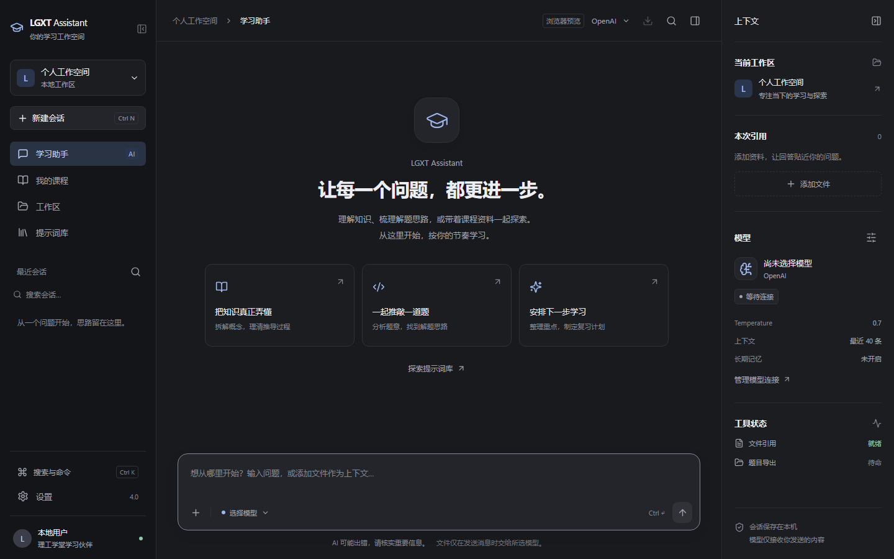
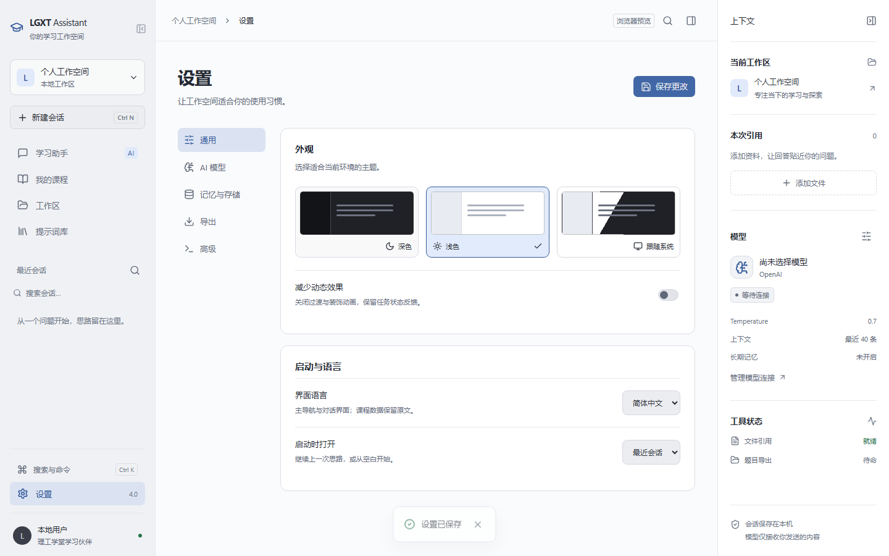

# LGXT Assistant · 理工学堂助手

面向学习的 Windows 桌面助手：查看理工学堂课程与作业、整理题目、导出 Word / PDF，并通过 AI 对话理解知识、分析资料。

**[下载 Windows 4.0.1](https://github.com/styayur/LGXT-Assistant/releases/tag/v4.0.1)** · **[中文 PDF 使用说明](https://github.com/styayur/LGXT-Assistant/releases/download/v4.0.1/LGXT-Assistant-4.0.1-User-Guide.pdf)** · [反馈问题](https://github.com/styayur/LGXT-Assistant/issues)



## 下载与打开

适用于 **Windows 10 / 11 x64**。普通使用者无需安装 Python 或 Node.js。

| Release 中的文件 | 用法 |
|---|---|
| `LGXT-Assistant.exe` | 单文件版，下载后双击。首次启动准备文件需要一点时间。 |
| `LGXT-Assistant-portable.zip` | 便携版，完整解压后运行 `LGXT-Assistant-portable.exe`，附 PDF 使用说明。 |
| `LGXT-Assistant-4.0.1-User-Guide.pdf` | 13 页中文图文说明，可离线查阅。 |
| `SHA256SUMS.txt` | 发布文件的 SHA-256 校验值。 |

**便携版请保留 EXE 同目录下的 `_internal` 文件夹，不要只拖出 EXE，也不要直接从压缩包内运行。** GitHub 自动提供的 Source code 是开发源码，不能双击使用。

新版界面需要 [Microsoft Edge WebView2 Runtime](https://developer.microsoft.com/microsoft-edge/webview2/)。缺少运行时或界面资源时，软件会显示启动帮助，可下载安装运行时、重新下载完整包，或进入兼容界面。4.0.1 提供 EXE 与便携 ZIP，不提供新的 MSI。

Android 用户请在 [v3.2.1 历史版本](https://github.com/styayur/LGXT-Assistant/releases/tag/v3.2.1) 下载对应 APK。本次 4.0.1 为 Windows 更新，本文及新版 PDF 介绍 Windows 界面。

## 第一次使用

1. **查看课程**：打开「我的课程 → 登录理工学堂」，输入平台账号和密码。课程登录与 AI 配置相互独立，未配置 AI 也能浏览和导出课程。
2. **整理题目**：进入课程和作业，查看题目、图片与参考答案；在「设置 → 导出」选择目录与格式后导出 Word / PDF。成绩操作需要再次确认，请先核对目标与分数。
3. **使用 AI**：打开「设置 → AI 模型」，填写模型服务、接口地址、模型 ID 和 API Key，点击「保存并测试连接」。显示 Connected 表示服务已返回结果。测试会发送一次简短请求，可能产生服务费用。
4. **加入资料**：在工作区添加文本、代码或图片，点击「引用到对话」再发送。PDF / Word 目前不能直接作为聊天附件，可先复制所需文字或使用截图。

操作步骤、参数解释、错误处理和备份方法见 [PDF 使用说明](output/pdf/LGXT-Assistant-4.0.1-User-Guide.pdf)。

## 4.0.1 更新

- **修复无法进入**：处理桌面连接延迟、凭据库阻塞、损坏的本地偏好与会话索引、旧配置异常；先备份异常资料，再允许继续使用。某条历史会话损坏不再阻塞整个界面。
- **登录可恢复**：等待超过 20 秒显示错误并恢复操作，可取消和重试；已取消的请求不会稍后自动把用户登录进去。
- **启动帮助**：缺失界面资源、依赖或 WebView2 时给出明确说明，并提供兼容界面入口。
- **全新桌面**：深色、浅色和跟随系统主题，可折叠三栏布局，课程与学习工作区，轻量动画和状态反馈。
- **AI 阅读与编辑**：流式回复、停止、重新生成、编辑、复制和 Markdown 导出，支持 Markdown、代码高亮、LaTeX、表格与图片。
- **日常效率**：历史会话搜索、重命名和删除；提示词库、工作区文件和当前任务；命令面板与模型服务切换。

支持 OpenAI、Claude 原生 Messages API、Gemini 的 OpenAI 兼容接口，以及 Ollama 等本地兼容服务。请填写自己账户实际可用的模型 ID。长期学习偏好由用户手动维护，知识资料通过显式文件引用加入，当前不包含自动向量检索。主导航和聊天支持中英文切换，设置及课程管理仍以中文为主。



## 快捷键

| 快捷键 | 操作 |
|---|---|
| Ctrl + K / Ctrl + Shift + P | 搜索功能、模型服务、会话和工作区文件 |
| Ctrl + N | 新建会话 |
| Ctrl + Enter | 发送消息；Enter 保留换行 |
| Esc | 关闭当前弹窗；无弹窗时停止 AI 生成 |
| F11 | 全屏 / 还原 |

## 打不开或登录失败

| 现象 | 处理方法 |
|---|---|
| 双击后没有新版界面 | 查看启动帮助。便携版重新完整解压；缺少 WebView2 时从微软官方安装。 |
| 一直显示正在连接桌面 | 关闭后从完整包中的主程序重新打开；不要将网页预览当作桌面应用。 |
| 提示资料恢复或备份 | 软件保留了异常文件的 `.bak` 副本。可继续新建会话；需要恢复旧资料时保留备份并反馈问题。 |
| 课程登录超时 | 取消后核对账号和网络，再重试；同时检查平台官网能否登录。 |
| 模型连接失败 | 检查 Endpoint、模型 ID、API Key、服务额度和本地模型是否已启动。 |
| 导出后找不到文件 | 检查设置中已保存的导出目录、格式与写入权限，阅读任务结果。 |

反馈时请提供版本、Windows 版本、下载的文件名、操作步骤和提示截图，并隐去密码、密钥及个人信息。启动错误日志位于 `%APPDATA%\LGXT-Assistant\logs\startup-error.log`（能够写入时）。

## 更新与资料备份

更新前关闭软件，将新版放入新文件夹。会话、工作区与偏好存放在 `%APPDATA%\LGXT-Assistant\desktop`，旧导出配置仍使用 `%APPDATA%\LGXT-Assistant\config.ini`。关闭软件后可复制整个 `%APPDATA%\LGXT-Assistant` 文件夹进行备份；导出的 Word / PDF 也应单独保留。

账号密码和模型密钥存储在系统凭据库，不在上述备份文件夹内。发送 AI 消息时，消息及所引用的资料会发送到你选择的模型服务；会话导出是 Markdown 文本，不是所有资料的完整备份。

## 源码运行与开发

推荐 Python 3.13、Node.js 22 与 WebView2。前端资源本地打包，运行时不依赖 CDN。

```powershell
py -3.13 -m pip install -r requirements.txt
cd frontend
npm ci
npm run build
cd ..
py -3.13 default.pyw

# 原 Tk 兼容界面
py -3.13 default.pyw --legacy
```

```powershell
# 测试与打包（确保 python 指向装有依赖的 Python 3.13）
python -m pip install -r requirements-dev.txt playwright pyinstaller
python -m playwright install chromium
python -m pytest -q
powershell -ExecutionPolicy Bypass -File packaging/build_exe.ps1
python scripts/check_frontend.py
python scripts/check_package.py
```

[重构设计与架构](docs/UI_MODERNIZATION.md) · [验证记录与测试边界](docs/VERIFICATION.md) · [4.0.1 发布说明](docs/releases/v4.0.1.md)

发布流程先测试、构建并验证两种 EXE 的真实启动，再上传附件。界面验证覆盖 1280×720、1920×1080、3840×2160 和窄窗口；`*-fixture.png` 中的课程、成绩与对话为测试示例。没有使用真实账号执行成绩提交或付费模型请求。

## 许可

GPL-3.0-or-later，详见 [LICENSE](LICENSE)。作者：StyAyur。
