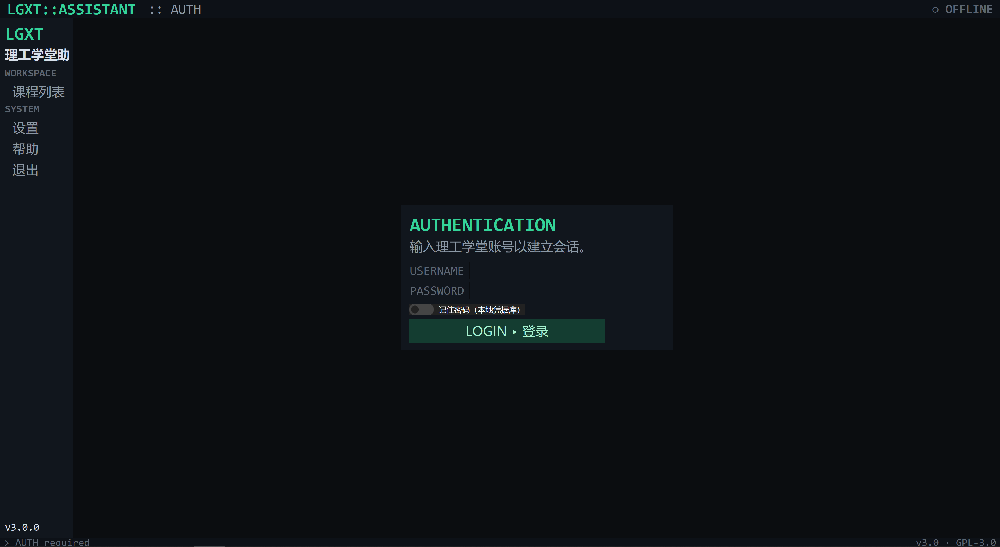
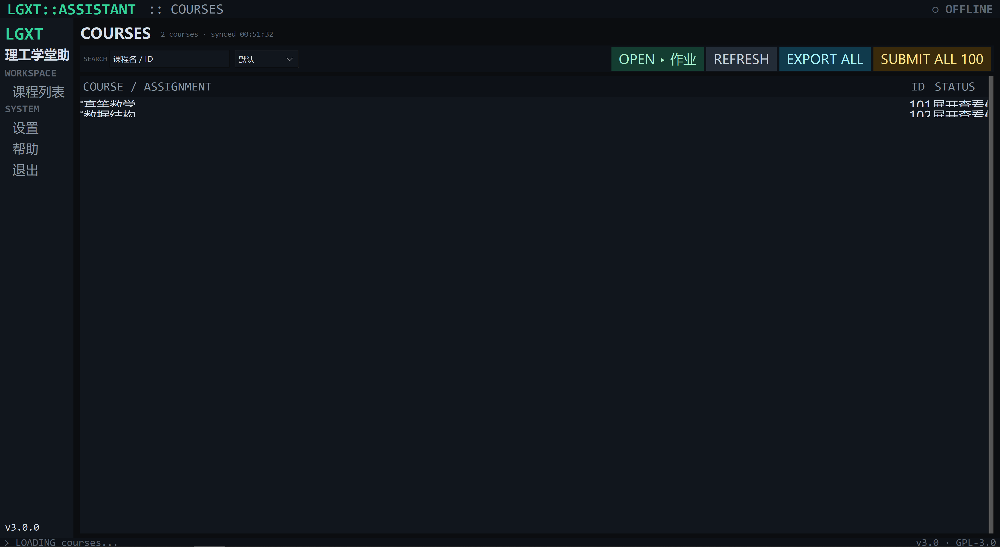
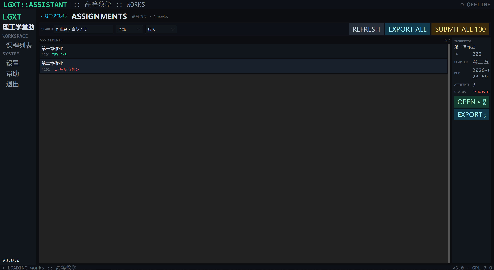
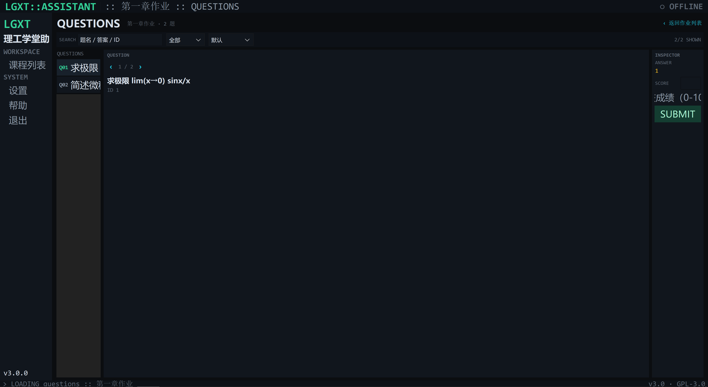
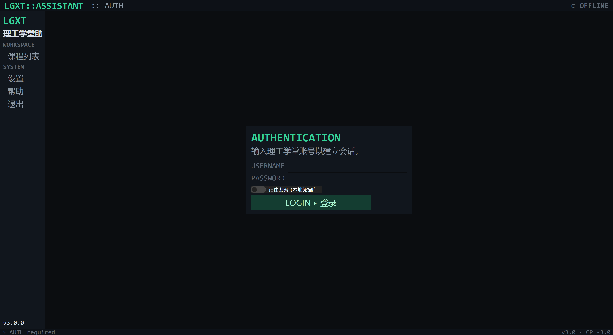

# LGXT Assistant · 理工学堂助手

> 面向理工学堂平台的 Windows 桌面工具：查看课程与作业、浏览/导出题目
> （图片 + 答案，Word / PDF）、单题与批量提交成绩。
>
> 界面为 **Developer Workbench** 风格：深色、无边框淡出层次、等宽技术字体、
> 科目/作业**树状展开**、本地**搜索/筛选/排序**、字体随窗口自适应。







---

## 主要特性

| 特性 | 说明 |
|---|---|
| 全屏工作区 | 启动即最大化；`F11` 在「最大化 / 真全屏」之间切换 |
| 自适应字体 | 窗口尺寸变化时按比例缩放全部 UI / 技术字体（0.9×–1.5×） |
| 树状主页 | 课程（科目）为父节点，展开时才懒加载该科目的作业子节点 |
| 搜索 / 筛选 / 排序 | 全部本地执行，不额外请求服务器（课程 / 作业 / 题目三页均可） |
| 无边框淡出美学 | 去掉所有硬线条：层级只靠背景深浅（BG → SURFACE → HOVER）表达 |
| 关闭代码雨 | 关闭窗口或点「退出」时播放 Matrix 代码雨特效后再退出 |
| 后台任务 | 页面加载 / 图片 / 提交 / 导出全部后台线程 + 队列，界面不阻塞 |
| 图片缓存 | 导出题目图片命中本地文件即跳过下载，损坏自动重下 |
| 导出 | 单作业 / 当前课程 / 全部课程 → Word(.docx)、PDF(.pdf)，可选含答案 |

## 环境要求

- Windows
- Python 3.7+

## 快速开始

```bash
pip install -r requirements.txt
python default.pyw
```

依赖：`keyring` `requests` `ttkbootstrap` `Pillow` `python-docx` `reportlab`

---

## 使用教程

### 1. 登录
AUTH 面板输入理工学堂用户名 / 密码；勾选「记住密码」写入本地凭据库（keyring）。
成功后右上角出现 `● CONNECTED`。

### 2. 主页：科目 / 作业树状展开
主页是一棵 **课程树**：

- 顶层节点 = 课程（科目），右侧显示课程 ID 与作业数量；
- 点击左侧箭头 **展开** 才去请求该课程的作业（懒加载，不浪费请求）；
- 作业子节点右侧显示 `STATUS`：`TRY 2/3`、`EXHAUSTED`、`DONE`；
- **单击**选中节点；**双击**：
  - 双击课程 → 进入该课程的作业工作区（List + Inspector）；
  - 双击作业 → 直接进入题目三栏工作区（自动选中该作业）。
- 顶部命令条：
  - `SEARCH`：按课程名 / ID 本地过滤；
  - `SORT`：默认 / 名称 A→Z / Z→A / ID；
  - `OPEN ▸ 作业 | 题目`（跟随当前选中节点）、`REFRESH`、`EXPORT ALL`、`SUBMIT ALL 100`。

### 3. 作业工作区（List + Inspector）
- 左列表：`SEARCH`（作业名/章节/ID）、`FILTER`（全部/可提交/已用完）、`SORT`（截止时间/剩余/名称）；
- 单击选中 → 右侧 **INSPECTOR** 显示 ID / 章节 / 截止 / 成绩 / 尝试次数 / 状态；
- `OPEN ▸ 题目` 进入题目页（也可双击行）；`EXPORT 题目` 单独导出该作业；
- 顶部 `EXPORT ALL` / `SUBMIT ALL 100` / `REFRESH` 为该课程批量操作。

### 4. 题目工作区（三栏）
- 左：题目列表（`SEARCH` 题名/答案/ID，`FILTER` 全部/有答案/无图片，`SORT` 编号/名称）；
- 中：当前题目名称、ID 与题面图片（异步加载 + 内存缓存）；
- 右：**INSPECTOR** 显示答案，输入 0–100 点 `SUBMIT` 提交该作业成绩；
- `‹` / `›` 切换题目；页头 `‹ 返回作业列表` 返回。

### 5. 设置
- `EXPORT`：Word / PDF、是否含答案；
- `PATH`：导出目录；
- 右侧 `SYSTEM`：API 地址、版本、许可、登录状态（真实信息，不伪造指标）；
- `SAVE` 写入 `config.ini`，`USER INFO` 查看账号信息。

### 6. 全屏 / 字体 / 退出特效
- 启动默认最大化（`state('zoomed')`，非锁定式全屏，可自由缩放）；
- `F11` 切换真全屏；
- 拖动窗口大小，字体自动按 `width/1440` 比例缩放（限幅 0.9–1.5）；
- 点侧栏「退出」或点窗口关闭按钮 → 播放约 1.8s **代码雨**（字符下落 + 层次渐隐）后退出。

---

## 项目结构

```
default.pyw   入口（python default.pyw）
theme.py      Design Token、无边框主题、字体缩放接口
ui.py         主窗口 / 树状主页 / 页面 / 搜索筛选排序 / 自适应字体 / 代码雨
api.py        API 客户端（session / 鉴权 / 统一 (ok, data) 错误结构）
tasks.py      题目收集、批量提交、批量导出（后台线程）
exporter.py   图片缓存 + Word / PDF 导出
config.py     config.ini 设置 + 本地凭据（keyring）
docs/         截图与文档资源
```

### 线程模型（开发者须知）

后台 worker 不直接操作任何控件，只把事件写入 `queue.Queue`；
主线程以 `after(60ms)` 轮询消费事件（状态 / 进度 / 图片 / 结果）。
导出开关在主线程读取为只读快照 `ExportOptions` 后传入 worker。
（若 worker 直接调用 `root.after`，在 Python 3.13 会抛 `RuntimeError` —— 本项目已规避。）

## 稳定性修复（代码审计后）

- **登录不再被 keyring 打断**：凭据读写全部容错；删除仅针对已存在条目，后端缺失也不会抛异常。
- **配置文件迁移**：默认写入 `%APPDATA%\LGXT-Assistant\config.ini`，首次运行自动读取并迁移旧版脚本目录配置。
- **内存占用可控**：题目图片字节与 `PhotoImage` 均设上限（40），重新进入题目页释放上一轮引用；字体缓存池化，不再为每个控件创建命名 Tk 字体。
- **树状主页更稳**：展开失败可重新展开重试；异步回调用 `exists(iid)` 保护，避免导航竞态抛 `TclError`。
- **非数字题目 ID 不再导致排序崩溃**（数字优先、字符串兜底）。
- **请求更克制**：页面加载最多 4 个在途请求，超出会忽略并提示；收集提前结束时取消未执行的 future。
- **字体遮挡修复**：缩放时同步调整 Header/StatusBar/Sidebar 高度与宽度、Treeview 行高/列宽、三栏与 Inspector 宽度；过长文本自动省略号，长标题/答案自动换行；ttk 控件字体统一走 Style，避免按控件改字体造成文字被裁切。
- **API 错误更准确**：区分"网络错误 / 非 JSON 响应 / 缺少字段"；图片下载校验 Content-Type、大小与空内容。

## 许可

GPL-3.0-or-later，详见 [LICENSE](LICENSE)。
本工具仅限学习交流使用，请勿转卖或用于商业用途。
Author: Styayur
