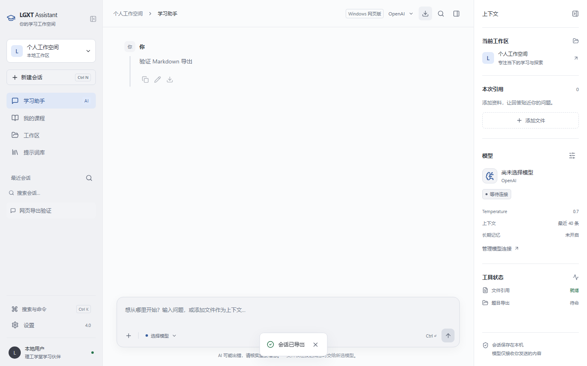

# LGXT Assistant 4.1.0 · Windows 网页版

在 Windows 10 / 11 x64 上双击 `LGXT-Assistant-Web.exe`，程序会启动本机服务并打开默认浏览器。无需 Python、Node.js 或 WebView2。保留启动窗口，使用结束后按 Ctrl+C 关闭服务。

- Edge / Chrome 中使用课程登录、课程与作业查看、题目整理、AI 流式对话和历史会话。
- 使用浏览器选择文本与图片附件，Markdown 会话通过浏览器下载。
- 设置中输入 Windows 导出目录，Word / PDF 保存到本机。
- 与桌面版共用 `%APPDATA%\LGXT-Assistant` 的资料和系统凭据库，避免同时运行两版编辑资料。
- 服务仅监听 `127.0.0.1`，每次启动生成独立连接凭证并检查请求来源。启动链接不要分享；此版本不提供公网或局域网多人服务。

刷新当前标签页可以继续使用。关闭标签页后可使用启动窗口里的链接重新打开。退出并重启程序后，旧链接失效。

GitHub 托管源码和 Windows 下载包；完整功能需要本机 Python 服务，不能作为纯静态 GitHub Pages 网站运行。现有 4.0.1 桌面版下载继续保留。

没有使用真实账号执行成绩提交或付费 AI 请求。

## 验证

- Python 测试 50 项通过，包括 8 项新增本机 HTTP 接口、来源/凭证检查和静态资源边界测试。
- PyInstaller 单文件 EXE 在 Windows 上实际启动，并通过 Chromium 自动化验证：连接、设置持久化、刷新恢复、会话 Markdown 下载、1280×720 / 1920×1080 布局、无 JavaScript 异常。
- 可复现命令：`py -3.13 -m pytest -q`、`py -3.13 scripts/check_web.py --exe dist/LGXT-Assistant-Web.exe`。

